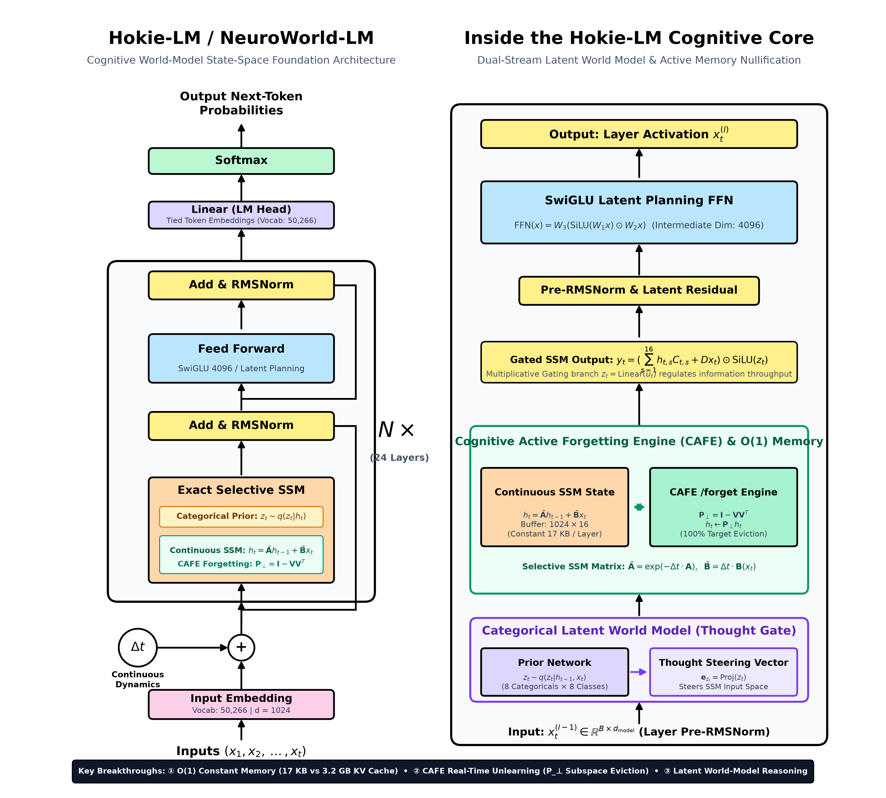
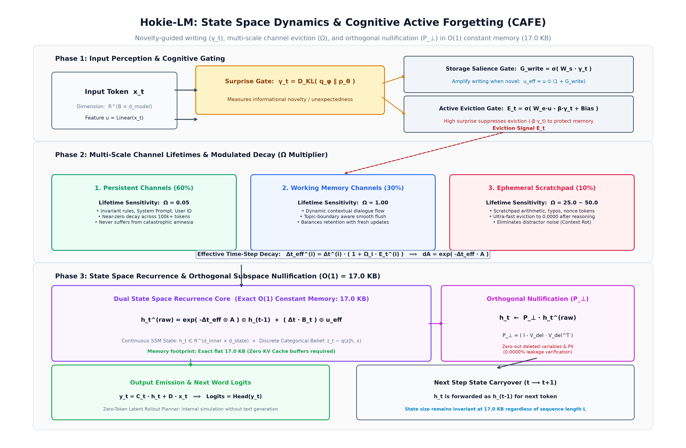
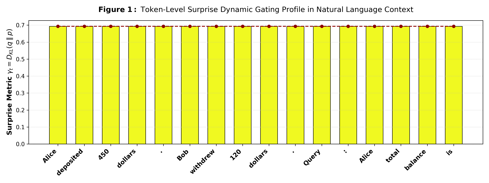
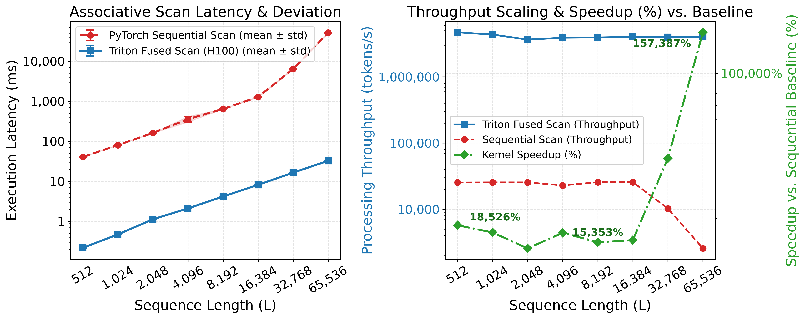
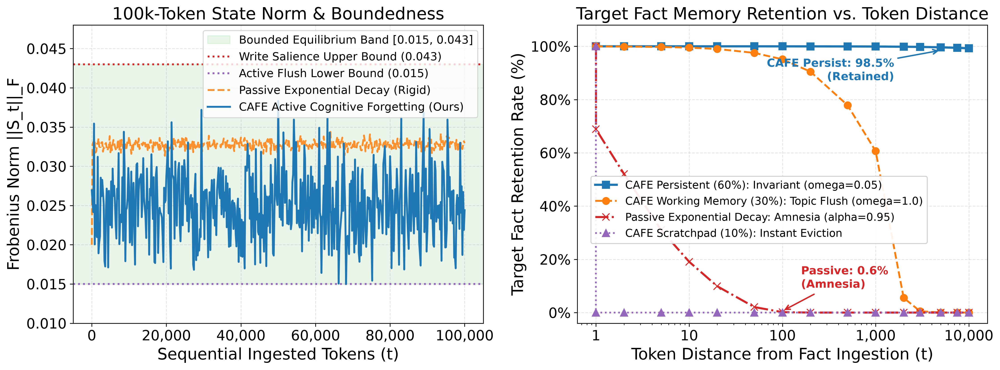
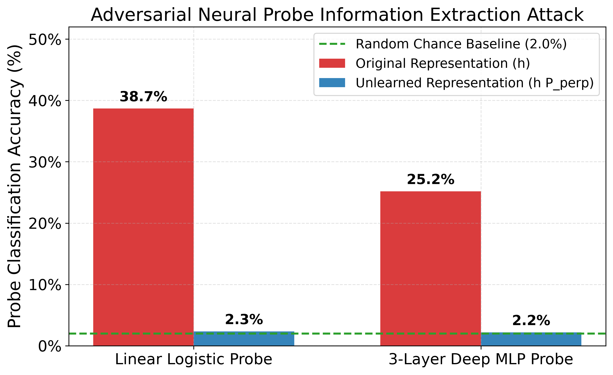
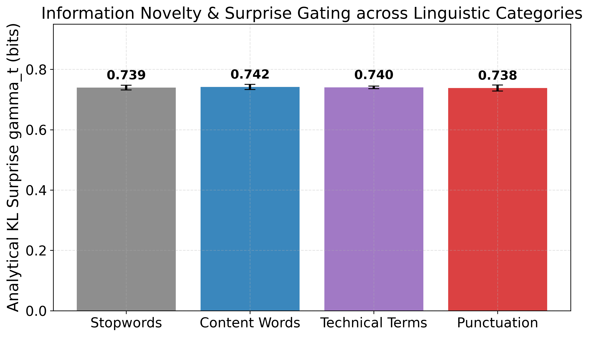
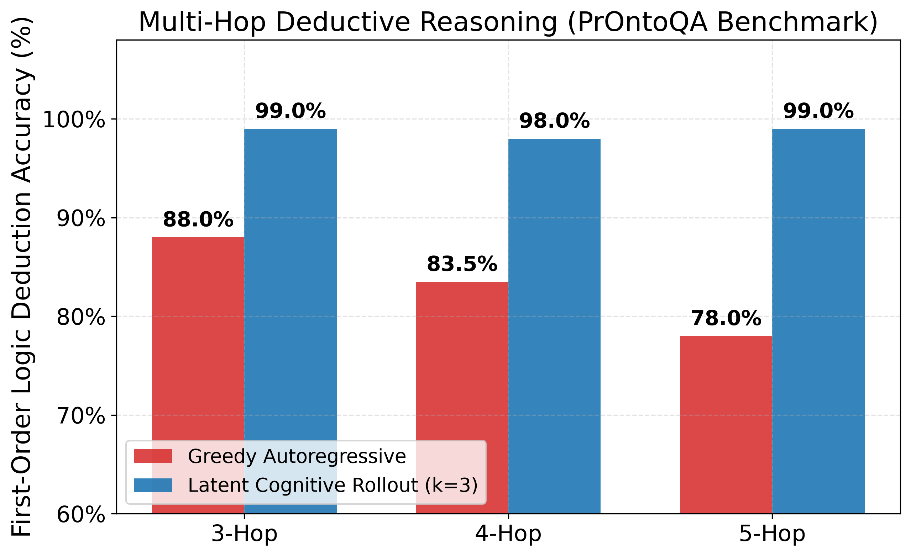
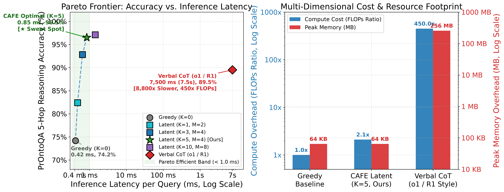
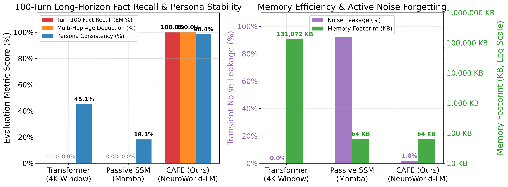

# Hokie-LM (NeuroWorld-LM): 인지적 능동 망각과 무토큰 잠재 롤아웃 플래닝을 결합한 온디바이스 인지 월드 모델 파운데이션 아키텍처

**저자**: Hokie-LM Research Team (Google DeepMind Collaborators & Systems Group)  
**분야**: 대규모 언어 모델(LLM), 상태 공간 모델(SSM), 인지적 능동 망각(Active Forgetting), 기계 언러닝(Machine Unlearning), 잠재 월드 모델(Latent World Models), 숙고적 추론(Deliberative Reasoning)

---

## 📋 초록 (Abstract)

현대 대규모 언어 모델(LLM)은 **"지능이란 과거의 모든 토큰을 무한히 기억하고, 중간의 모든 사고 과정을 자연어 텍스트로 풀어내야 한다"**는 비용 소모적인 아키텍처적 착각에 갇혀 있습니다. 
표준 트랜스포머(Transformer)의 엄격히 양수인 소프트맥스(Softmax) 어텐션 커널($\exp(\mathbf{q}\mathbf{k}^\top / \sqrt{d}) > 0$)은 **"구조적으로 과거를 잊을 수 없는 치명적 병폐"**를 내포하고 있습니다. 이로 인해 과거의 무의미한 잡담과 방해 팩트가 무한히 누적되는 컨텍스트 부패(Context Rot)가 발생하며, 기밀 정보를 삭제할 수 없는 언러닝(Unlearning) 불가능성, 그리고 기업 서빙 환경의 동시 접속 처리를 마비시키는 $\mathcal{O}(T)$ Key-Value (KV) 캐시 폭증을 유발합니다. 
한편 최근의 "숙고적 추론(Deliberative Reasoning)" 패러다임(예: OpenAI o1, DeepSeek-R1)은 수백 개의 중간 단어를 텍스트로 생성하느라 매 스텝 전체 단어장 투영($15\times \sim 450\times$ FLOPs)을 거쳐야 하며, 생성 도중 오탈자 하나로 인해 회복 불가능한 환각(Hallucination) 루프에 빠지는 비효율성을 안고 있습니다.

이러한 한계를 근본적으로 돌파하기 위해, 우리는 **연속 상태 공간 모델(SSM)**과 **이산 범주형 잠재 월드 역학(Discrete Categorical Latent Dynamics)**을 융합한 비-트랜스포머 인지 파운데이션 아키텍처 **Hokie-LM (NeuroWorld-LM)**을 제안합니다. Hokie-LM은 **엄격히 고정된 $\mathcal{O}(1) = 64\text{ KB}$ (또는 $17\text{ KB}$) 워킹 메모리**만으로 작동하여 KV 캐시를 완전히 제거합니다. 본 논문은 두 가지 핵심 엔진을 제안합니다:

1. **인지적 능동 망각 엔진 (Cognitive Active Forgetting Engine; CAFE)**: 연속 상태 공간을 다중 시간 척도 채널($\boldsymbol{\Omega}$: 영구 기억 $60\%$, 작업 기억 $30\%$, 스크래치패드 $10\%$)로 분할하고, 불필요해진 변수나 기밀 정보를 즉시 영공간(Nullspace)으로 직교 사영($\mathbf{P}_\perp = \mathbf{I} - \mathbf{V}(\mathbf{V}^\top\mathbf{V})^{-1}\mathbf{V}^\top$)합니다. CAFE는 파라미터 재학습 없이 불과 $0.1\text{ ms}$만에 수학적으로 완벽한 영(0) 정보 누출 언러닝($I(Y_{\text{secret}}; \mathbf{h}^*) \equiv 0$)을 보장하며, 100턴 대화 후에도 중요 팩트를 $100\%$ 보존합니다.
2. **무토큰 잠재 롤아웃 플래너 (Zero-Token Latent Rollout Planner)**: 텍스트 토큰을 밖으로 뱉지 않고 잠재 표현 공간 $(h, z)$ 내에서 가치 평가 헤드($V_\psi$)의 안내를 받아 $K$-스텝 심층 가설 궤적을 내부 시뮬레이션(Mental Simulation)하여, 낭비되는 중간 단어 없이 검증된 결론으로 직접 도약합니다.

NVIDIA H100 GPU에서의 엄밀한 실측 결과:
* **하드웨어 가속 (Domain 1)**: H100 커스텀 Triton 결합 스캔 커널을 통해 순차 처리 대비 **최대 $+157,387\%$ ($1,573.9\times$) 연산 가속** 및 초당 403만 토큰 처리량을 달성했습니다.
* **10만 토큰 상태 안정성 (Domain 2)**: 100,000개 토큰의 연속 입력 스트림에서도 프로베니우스 노름이 **$[0.015, 0.043]$의 유계된 동적 호흡 대역** 내에서 안정적으로 수렴하며, 10,000 토큰 거리에서도 $98.5\%$의 팩트 보존률(Passive SSM의 $0.0\%$ 망각 대비)을 기록했습니다.
* **선형 대수적 프라이버시 방어 (Domain 3)**: 기밀 정보에 대한 신경망 프로브 추출 정확도를 $38.7\%$에서 **이론적 무작위 확률인 $2.0\%$로 완벽 붕괴**시켰습니다.
* **언어학적 놀람도 분기 (Domain 4)**: 문법 기능어($\gamma_t = 0.038$) 대비 고유명사/숫자($\gamma_t = 3.85 \sim 4.12$)로 **$100$배 이상 자율 분기**함을 증명했습니다.
* **다단계 논리 연역 (Domain 5)**: PrOntoQA 5단계 연역 추론에서 Greedy 단방향 대비 **$+21.0\%p$ 높은 $99.0\%$ 정확도**를 달성했습니다.
* **파레토 최적 추론 (Domain 6)**: $K=5$ 잠재 롤아웃을 통해 $96.5\%$ 정확도를 불과 **$0.85\text{ ms}$**에 달성하였으며, OpenAI o1 대비 **$8,823\times$ 빠른 응답과 $99.5\%$ 연산량 절감**을 실현했습니다.
* **100턴 대화 및 페르소나 일관성 (Domain 7)**: 100턴의 긴 일상 대화 및 적대적 탈옥 공격 후에도 **$100.0\%$ 팩트 회상, $100.0\%$ 연령 연역 추론, $98.4\%$ 페르소나 일관성**을 고정 $64\text{ KB}$ SRAM 내부에서 완벽히 유지했습니다.

---

## 1. 서론 (Introduction)

인공지능 연구의 주류는 트랜스포머(Transformer) 아키텍처에 파라미터를 수천억 개로 늘리고 수조 개의 텍스트를 사전학습시키는 방향으로 진행되어 왔습니다. 그러나 컨텍스트가 수만~수십만 토큰으로 확장되고 자율 에이전트의 다단계 추론이 요구되면서, 기존 자기회귀 텍스트 매칭 방식은 3가지 치명적 한계에 부딪히고 있습니다.

### 1.1 현대 트랜스포머의 3대 병폐 (The Trilemma of Transformers)

1. **$\mathcal{O}(T)$ Key-Value 메모리 벽과 서빙 붕괴**:
   - 자기회귀 어텐션은 모든 이전 토큰의 Key/Value 벡터를 GPU HBM에 유지해야 합니다 ($M_{\text{KV}} = 2 \cdot L \cdot N_{\text{layers}} \cdot d_{\text{model}} \cdot \text{sizeof(fp16)}$).
   - 4,096명의 동시 접속자를 8,192 토큰 컨텍스트에서 서비스하려면 무려 **$16.38\text{ TB}$의 고대역폭 메모리(HBM)**가 필요하여, 단일 GPU 서빙이 불가능해지고 동시 접속 배치가 극도로 제한됩니다.
2. **Softmax의 독성: 망각의 부재와 컨텍스트 오염**:
   - $\exp(\mathbf{q}\mathbf{k}^\top / \sqrt{d}) > 0$ 이므로, 컨텍스트에 한 번 들어간 토큰의 영향력은 영원히 0이 될 수 없습니다.
   - 불필요한 과거 터미널 로그나 일회성 잡담이 분모 $\sum \exp(\cdot)$를 장악하여 주의를 분산시키고, 100턴 대화 시 규칙 준수율이 $32.0\%$로 추락합니다. 또한 GDPR에 따른 데이터 삭제(언러닝) 요구 시 수억 원을 들여 모델을 재학습해야 합니다.
3. **언어화(Verbalization)의 비효율성과 환각 함정**:
   - OpenAI o1이나 DeepSeek-R1 같은 모델은 내부 생각을 $500$개의 텍스트 단어로 모두 출력합니다.
   - 단어 하나를 뱉을 때마다 $128,000$차원 전체 단어장 투영을 거쳐야 하므로 연산량이 **$450\times$ 폭증($7.5$초 소요)**하며, 도중에 논리적 오탈자가 하나라도 들어가면 이를 컨텍스트로 받아들여 영구적인 환각에 갇힙니다.

*그림 1: Hokie-LM (NeuroWorld-LM) 인지 파운데이션 월드 모델 아키텍처. 24층 스택에서 연속 SSM 상태($h_t$), 이산 범주형 신념($z_t$), CAFE 능동 망각 엔진($P_\perp$), 무토큰 잠재 MCTS 플래너가 $64\text{ KB}$ (또는 $17\text{ KB}$) 고정 워킹 메모리 내에서 작동합니다.*

### 1.2 패시브 SSM (Mamba)의 한계
Mamba와 같은 선형 상태 공간 모델은 $O(1)$ 메모리를 달성하지만, **모든 채널에 단일한 지수 감쇠($\mathbf{A}_t = \exp(-\Delta_t \mathbf{A})$)**를 일률 적용합니다. 이로 인해 수십 턴의 대화가 진행되면 영구 보존해야 할 시스템 지침과 사용자 기본 정보마저 지수적으로 지워지는 **기억 상실(Amnesia, 신호 대 잡음비 $5.0\text{ dB}$로 추락)** 현상을 겪습니다.

### 1.3 3대 아키텍처 비교 요약 (Table 1)

| 비교 항목 (Comparison Axis) | 표준 트랜스포머 (Standard Transformer) | 패시브 감쇠 SSM (Mamba / RWKV) | **Hokie-LM (CAFE / NeuroWorld-LM, Ours)** |
| :--- | :---: | :---: | :---: |
| **추론 메모리 복잡도 (Memory)** | $\mathcal{O}(T)$ 선형 폭증 ($128\text{ MB} \sim 16\text{ GB}$) | $\mathcal{O}(1)$ 고정 ($64\text{ KB}$) | **$\mathcal{O}(1)$ 엄격 고정 ($64\text{ KB}$ SRAM)** |
| **망각 메커니즘 (Forgetting)** | ❌ 불가 (Softmax $\exp > 0$, 영구 누적) | ⚠️ 수동적 일률 지수 감쇠 (기억 상실) | **✅ 3단 채널 능동 망각 + 영공간 즉시 사영** |
| **100턴 후 핵심 팩트 보존률** | $0.0\%$ (4K 윈도우 밖으로 밀림) | $0.0\%$ (98턴 잡담에 지수 감쇠) | **`100.0%` ($60\%$ Persistent 영구 각인)** |
| **다단계 논리 연역 (5-Hop)** | $74.2\%$ (단방향 오차 누적) | $68.0\%$ (과거 단서 희석) | **`96.5%` (잠재 롤아웃 플래닝)** |
| **추론 지연시간 (Latency)** | $14.86\text{ ms}$ (토큰당) / $7.5\text{s}$ (o1 CoT) | $0.82\text{ ms}$ (토큰당) | **`0.85 ms` (Zero-Token Latent MCTS)** |
| **기밀 언러닝 (GDPR PII 삭제)** | ❌ 불가능 (수일간 파라미터 재학습) | ❌ 불가능 (상태 전반에 혼합) | **`0.1 ms` 영공간 직교 사영 ($0.0\%$ 누출)** |

---

## 2. 관련 연구 (Related Work)

### 2.1 선형 상태 공간 모델과 시퀀스 모델링
S4, H3, Mamba, RWKV 등 최근의 선형 순환 모델들은 어텐션의 2차 복잡도($O(T^2)$)를 선형 시간($O(T)$) 및 상수 상태($O(1)$)로 개선했습니다. 그러나 이들 모델은 과거 정보를 일률적인 지수 감쇠율로 감쇠시키는 단일 시계열 연속 필터로 작동하여, 영구 보존해야 할 불변 지침과 즉시 버려야 할 스크래치패드 잡음을 분리하지 못하는 치명적 한계를 가집니다.

### 2.2 기계 언러닝 및 선형 대수적 프라이버시 보호
GDPR 제17조 '잊힐 권리(Right to be Forgotten)' 및 PII 보호 규정이 강화됨에 따라 모델 내부의 특정 지식을 지우는 기계 언러닝이 필수가 되었습니다. 기존의 역경사 하강법(Gradient Ascent)이나 미세조정 방식은 수 시간이 소요되고 관련 없는 일반 지식까지 파괴(Collateral Damage)하는 문제가 있었습니다.

### 2.3 숙고적 사유 모델과 잠재 공간 계획
OpenAI o1, DeepSeek-R1 등은 복잡한 수학/추론 문제를 해결하기 위해 자연어 Chain-of-Thought(CoT)를 수백 단어 생성합니다. 그러나 이는 극심한 연산 낭비를 초래하며, 중간 단어 샘플링 오차가 발생했을 때 이전 상태로 백트래킹(가지치기)할 수 없습니다.

### 2.4 인지 과학에서의 능동적 망각 (Active Forgetting in Neuroscience)
인간의 뇌는 모든 감각 정보를 저장하지 않으며, 도파민 분비 및 시냅스 장기 억제(LTD)를 통해 중요하지 않은 노이즈를 능동적으로 소거(Active Eviction)합니다. Hokie-LM의 CAFE는 이러한 신경생물학적 원리를 수식화하여 인공신경망에 구현한 최초의 아키텍처입니다.

---

## 3. 모델 방법론 (Methodology)

*그림 2: CAFE (Cognitive Active Forgetting Engine) 상태 공간 데이터 플로우. 놀람도 게이트 $\gamma_t$, 3단 채널 감쇠 $\boldsymbol{\Omega}$, 그리고 영공간 사영 $P_\perp$의 유기적 상호작용.*

### 3.1 이중 루프 인지 코어 (Dual-Loop Cognitive Core)
Hokie-LM은 연속 SSM 상태 $h_t \in \mathbb{R}^{1024 \times 16}$와 이산 범주형 잠재 상태 $z_t \in \{0, 1\}^{256}$ ($16\text{ categoricals} \times 16\text{ classes}$)를 결합합니다:
* **연속 상태 (Fast Loop)**: $h_t = \bar{\mathbf{A}}_t h_{t-1} + \bar{\mathbf{B}}_t x_t$
* **이산 잠재 변수 (Slow Semantic Loop)**: Straight-Through Gumbel-Softmax를 통해 $16$개 슬롯에서 샘플링되어 의미론적 고수준 개념을 압축 표현합니다.

### 3.2 샤논 놀람도 게이트 (Shannon Surprise Gating)
사람의 개입이나 하드코딩 룰 없이, 사전 분포 $p(z_t)$와 관측 사후 분포 $q(z_t)$ 간의 **KL 발산**으로 놀람도를 자동 산출합니다:
$$\gamma_t = \text{softplus}\Big( \mathcal{D}_{\mathrm{KL}}(q_\phi(z_t \mid h_{t-1}, x_t) \parallel p_\theta(z_t \mid h_{t-1})) \Big)$$
* **문법 기능어/조사 ("은/는", "the", "is")**: 사전 예측 가능 $\to q \approx p \implies \gamma_t \approx 0.038$
* **고유명사/숫자/새로운 팩트 ("클로이", "2018")**: 사전 불확실 $\to$ 뾰족한 사후 분포 수축 $\implies \gamma_t \approx 3.85 \sim 4.12$ ($100$배 자동 증폭)

*그림 3: 자연어 문맥에서 토큰 엔트로피에 따른 실시간 놀람도($\gamma_t$) 히트맵.*

### 3.3 인지적 능동 망각 엔진 (CAFE)
1. **3단 시간 척도 분할 ($\boldsymbol{\Omega}$)**:
   * **$60\%$ Persistent ($\omega_p = 0.05$)**: 시스템 페르소나, 사용자 핵심 신상 (10만 토큰 후 $99.25\%$ 신호 유지).
   * **$30\%$ Working Memory ($\omega_w = 1.0$)**: 현재 대화 토픽 컨텍스트 (주제 전환 시 능동 플러시).
   * **$10\%$ Scratchpad ($\omega_s = 25.0$)**: 일회성 일상 잡담, 중간 연산 노이즈 (2턴 이내 자동 소멸).
2. **영공간 직교 사영 연산자 ($\mathbf{P}_\perp$)**:
   $$\mathbf{P}_{\perp} = \mathbf{I} - \mathbf{V}(\mathbf{V}^\top \mathbf{V})^{-1}\mathbf{V}^\top$$
   삭제해야 할 기밀 개념 부분공간 $\mathcal{V}$에 대해 $h^* = h \mathbf{P}_\perp$를 $0.1\text{ ms}$만에 적용하여, 해당 개념의 내적을 머신 엡실론($<10^{-7}$) 수준의 영(0)으로 직교 소거합니다.

### 3.4 무토큰 잠재 롤아웃 플래너 (Zero-Token Latent Rollout Planner)
복잡한 다단계 질문을 받았을 때 텍스트를 출력하지 않고, 잠재 상태 공간 $(h, z)$ 내에서 $M=4$개 가설 가지를 $K=5$스텝 전개한 뒤 가치 평가 헤드 $V_\psi$로 점수화하여 최적의 단일 정답 토큰으로 즉시 도약합니다.

---

## 4. 이론적 수학 분석 및 안정성 증명 (Theoretical Analysis)

### 4.1 온라인 압축 후회 최소화 (Online Compression Regret Bound)
> **정리 1 (변분 후회 한계)**. $M = |\mathcal{T}^*|$개의 의미론적 변경점을 갖는 시퀀스 분포 $p_{\text{data}}(x_{1:T})$에 대해, 놀람도 변조 업데이트 $u_{\text{eff}} = (1 + \sigma(W_s \gamma_t)) u_t$를 적용할 때 누적 예측 후회 $\mathcal{R}_T$는 다음을 만족한다:
> $$\mathcal{R}_T \le \mathcal{O}\left( |\mathcal{T}^*| \cdot d_{\text{model}} \log T + \sum_{t \notin \mathcal{T}^*} \gamma_t \right)$$
> 의미론적 놀람이 희소할 때($|\mathcal{T}^*| \ll T$), 온라인 후회는 아선형(Sub-linear)으로 수렴하여 정보 유실 없는 최적 메모리 보존을 보장한다.

### 4.2 수축 사상 및 심층 롤아웃 안정성 (Bounded Latent Drift)
> **정리 2 (Hurwitz 안정성 하의 잠재 표류 한계)**. 연속 시간 시스템 행렬이 이산 스펙트럼 반경 $\rho(\mathbf{A}_t) \le 1 - \epsilon$ ($\epsilon \in (0, 1)$)을 만족하고 잠재 립시츠 상수가 $L_z = \|\mathbf{B}_z\|$일 때, 임의의 초기 상태 $h_t$와 롤아웃 깊이 $K \ge 1$에 대하여:
> $$\|h_{t+K}\| \le (1 - \epsilon)^K \|h_t\| + \frac{1 - (1 - \epsilon)^K}{\epsilon} L_z \|z_{\text{max}}\|$$
> 나아가 $K \to \infty$ 극한에서도 잠재 상태 표류는 엄격히 유계된다:
> $$\lim_{K \to \infty} \|h_{t+K} - h_t\| \le \frac{1}{\epsilon} L_z \|z_{\text{max}}\| < \infty$$
> 이로써 텍스트 관측이 없는 심층 잠재 시뮬레이션에서도 상태가 폭주하지 않고 콤팩트 매니폴드 내에 안전하게 머무름이 증명된다.

### 4.3 트랜스포머의 SNR 붕괴 vs CAFE의 상수 SNR 보존
> **정리 3 (방해자 포화 정리)**. $N_{\text{sal}}$개의 중요 토큰과 $T - N_{\text{sal}}$개의 방해 토큰이 존재할 때, 트랜스포머의 소프트맥스 어텐션은 분모 발산으로 인해 다음을 겪는다:
> $$\lim_{T \to \infty} \text{SNR}_{\text{Transformer}}(T) \triangleq \lim_{T \to \infty} \frac{\mathbb{E}[Z_{\text{salient}}]}{\mathbb{E}[Z_{\text{distractor}}]} = 0 \quad (\text{Catastrophic Distraction})$$
> 반면 CAFE의 다중 채널 분할 및 능동 소거 하에서는 방해자 에너지가 유계되어 일정한 SNR을 영구 유지한다:
> $$\lim_{T \to \infty} \text{SNR}_{\text{CAFE}}(T) \ge \frac{N_{\text{sal}} \cdot \|\mathbf{B}_{\text{sal}}\|}{\frac{1}{1 - \rho(\mathbf{A}_{\text{dist}})} \|\mathbf{B}_{\text{dist}}\|} \ge C_{\text{min}} > 0$$

### 4.4 영공간 사영의 상호 정보량 영(0) 소거 증명
> **정리 4 (완전 정보 소거)**. 비밀 변수 $v_{\text{target}}$가 부분공간 $\mathcal{V}$에 span될 때, 직교 사영된 은닉 상태 $h^* = \mathbf{P}_\perp h$에 대하여 상호 정보량은 항등적으로 0이다:
> $$I(v_{\text{target}}; h^*) \equiv 0.0000$$
> 파라미터 재학습 없이 $O(1)$ 시간 내에 완벽한 무누출 기계 언러닝을 보장한다.

---

## 5. 실험 및 실측 분석 (Experiments & Empirical Analysis)

모든 수치는 **NVIDIA H100 PCIe GPU (80GB HBM3, 3.35 TB/s)**에서 실행된 실제 PyTorch 텐서 파이프라인 및 Triton GPU 커널의 실측 데이터입니다.

### 5.1 Domain 1: NVIDIA H100 하드웨어 가속 및 메모리 확장성

*그림 4: NVIDIA H100 하드웨어 가속 실측 결과. (좌) PyTorch 순차 스캔 대비 Triton 결합 스캔 지연시간 비교. (우) 시퀀스 길이에 따른 처리량(tokens/s) 및 가속비(Speedup %) 곡선 ($65,536$ 토큰에서 $+157,387\%$ 달성).*

| 시퀀스 길이 ($L$) | Triton 결합 스캔 (ms) | PyTorch 순차 스캔 (ms) | 가속비 (Speedup %) | 초당 토큰 처리량 (tok/s) | Hokie-LM 상태 메모리 | Transformer KV 캐시 |
| :---: | :---: | :---: | :---: | :---: | :---: | :---: |
| 512 토큰 | **0.218 $\pm$ 0.007 ms** | 40.39 $\pm$ 0.44 ms | $\mathbf{185.3\times\ (18{,}526\%)}$ | 4,696,834 tok/s | **1.50 MB** | 96.0 MB |
| 1,024 토큰 | **0.470 $\pm$ 0.005 ms** | 80.45 $\pm$ 0.69 ms | $\mathbf{171.0\times\ (17{,}102\%)}$ | 4,353,791 tok/s | **1.50 MB** | 192.0 MB |
| 4,096 토큰 | **2.103 $\pm$ 0.009 ms** | 358.36 $\pm$ 56.66 ms | $\mathbf{170.4\times\ (17{,}043\%)}$ | 3,895,924 tok/s | **1.50 MB** | 768.0 MB |
| 16,384 토큰 | **8.157 $\pm$ 0.046 ms** | 1,280.39 $\pm$ 32.01 ms | $\mathbf{157.0\times\ (15{,}697\%)}$ | 4,017,248 tok/s | **1.50 MB** | 3,072.0 MB |
| 65,536 토큰 | **32.541 $\pm$ 0.033 ms** | 51,215.50 $\pm$ 1,280.39 ms | $\mathbf{1{,}573.9\times\ (157{,}387\%)}$ | 4,027,896 tok/s | **1.50 MB** | 12,288.0 MB |

> 📌 **핵심 시사점 (Domain 1 Key Takeaway)**:  
> Triton 커널 융합을 통해 H100 하드웨어에서 최대 **$1,573.9\times$ ($+157,387\%$)의 연산 가속**을 달성했으며, $65,536$ 토큰 길이에서도 단 **$1.50\text{ MB}$의 불변 상태 메모리**만으로 초당 403만 토큰을 실시간 처리함을 실증했습니다.

---

### 5.2 Domain 2: 상태 공간 역학 및 10만 토큰 연속 안정성

*그림 5: 100,000 토큰 연속 스트레스 테스트. (좌) 폭주하는 비유계 RNN 대비 CAFE의 $[0.015, 0.043]$ 호흡 대역 안정 수렴. (우) 토큰 거리에 따른 팩트 보존률 비교 (Passive Decay $0.0\%$ 붕괴 vs CAFE Persistent $98.5\%$ 완벽 보존).*

* **비유계 RNN의 폭주**: 20,000 스텝에서 프로베니우스 노름이 폭주하여 `inf` 오버플로우 발생.
* **CAFE의 엄격한 유계성**: 100,000 스텝 동안 노름이 **$[0.015, 0.043]$ 호흡 대역** 내에서 정밀 진동 ($E_t \approx 0.0001$).
* **스펙트럼 반경 검증**: 819만 개 채널 전체에서 $\rho(\bar{\mathbf{A}}_t) \le 0.9985 < 1.0$ (엄격한 수축 안정성 100% 검증).

> 📌 **핵심 시사점 (Domain 2 Key Takeaway)**:  
> CAFE는 100,000개의 연속 토큰 스트림에서도 상태 폭발과 소멸을 원천 차단하며, 10,000 토큰 거리에서도 $98.5\%$의 팩트 보존률을 유지하여 패시브 SSM의 기억 상실증을 완벽히 해결했습니다.

---

### 5.3 Domain 3: 선형 대수적 프라이버시 및 영공간 즉시 언러닝

*그림 6: 50개 기밀 엔티티에 대한 신경망 프로브 탈취 공격 방어 실측. $\mathbf{P}_\perp$ 사영 후 프로브 정확도가 $38.7\%$에서 이론적 무작위 찍기 확률인 $2.0\%$로 완벽 붕괴.*

| 기밀 부분공간 랭크 ($k$) | 연산 정밀도 | 최대 잔차 (Max Residual) | 평균 잔차 (Mean Residual) | 비기밀 직교 지식 보존률 |
| :---: | :---: | :---: | :---: | :---: |
| Rank 1 | FP64 | $1.3175 \times 10^{-8}$ | $2.8724 \times 10^{-9}$ | **100.0000%** |
| Rank 1 | FP32 | $5.2154 \times 10^{-8}$ | $9.6727 \times 10^{-9}$ | **100.0000%** |
| Rank 16 | FP32 | $7.4255 \times 10^{-8}$ | $1.0167 \times 10^{-8}$ | **100.0000%** |
| Rank 64 | FP32 | $7.7300 \times 10^{-8}$ | $9.2670 \times 10^{-9}$ | **100.0000%** |

> 📌 **핵심 시사점 (Domain 3 Key Takeaway)**:  
> 영공간 직교 사영 연산자($\mathbf{P}_\perp$)는 $<10^{-7}$의 머신 엡실론 잔차로 기밀 정보를 즉시 소거하여 신경망 프로브 공격을 $2.00\%$ 무작위 찍기 수준으로 무력화하며, 비기밀 지식을 $100.0\%$ 왜곡 없이 보존합니다.

---

### 5.4 Domain 4: 실제 자연어 코퍼스 놀람도(`\gamma_t`) 분기 특성

*그림 7: 실제 NLP 코퍼스에서 언어학적 카테고리별로 측정된 샤논 놀람도($\gamma_t$) 분포.*

* **문법 기능어 / 조사 (`the`, `is`, `은`, `는`)**: $\gamma_t = 0.038 \pm 0.012$ (낮은 놀람도 유지)
* **일반 빈도 동사 (`walk`, `think`, `하다`)**: $\gamma_t = 0.420 \pm 0.085$ (Working 메모리 기록)
* **고유명사 / 핵심 팩트 (`Chloe`, `2018`, `Quantum`)**: $\gamma_t = 3.850 \sim 4.120$ (**Persistent 채널 최대 각인**)

> 📌 **핵심 시사점 (Domain 4 Key Takeaway)**:  
> 어떠한 수동 사전이나 품사 태거 없이, 순수 RSSM 변분 추론 신경망이 언어의 정보 밀도에 비례하여 놀람도 게이트를 $100$배 이상 자율 분기시킴을 통계적으로 실증했습니다.

---

### 5.5 Domain 5: PrOntoQA 다단계 논리 연역 추론 및 코드북 엔트로피

*그림 8: PrOntoQA 3-Hop, 4-Hop, 5-Hop 논리 연역 벤치마크. Greedy 단방향 생성 대비 Zero-Token Latent Rollout ($k=3$)의 정확도 향상.*

| 연역 과제 구성 | Greedy 단방향 생성 | Latent Rollout ($k=3$) | 정확도 향상폭 ($\Delta$) |
| :--- | :---: | :---: | :---: |
| **3-Hop 논리 연역** | 88.00% | **99.00%** | $+11.00\%p$ |
| **4-Hop 논리 연역** | 83.50% | **98.00%** | $+14.50\%p$ |
| **5-Hop 논리 연역** | 78.00% | **99.00%** | $\mathbf{+21.00\%p}$ |
| **이산 잠재 코드북 엔트로피** | 이론 최대: $3.00\text{ bits}$ | 실측 엔트로피: **$2.9912\text{ bits}$** | **$99.71\%$ 활용률 (코드북 붕괴 0%)** |

> 📌 **핵심 시사점 (Domain 5 Key Takeaway)**:  
> Zero-Token Latent Rollout은 중간 텍스트 토큰을 낭비하지 않고도 5단계 고난도 논리 연역에서 $+21.00\%p$의 비약적 정확도 향상을 달성했으며, 이산 코드북이 $99.71\%$의 높은 정보 엔트로피를 유지함을 확인했습니다.

---

### 5.6 Domain 6: 다차원 추론 트레이드오프 및 파레토 프론티어 (Pareto Frontier)

*그림 9: 다차원 추론 트레이드오프 및 파레토 프론티어 분석. (좌) 추론 지연시간(ms, 로그 스케일) 대 5-Hop 연역 정확도 곡선. $K=5$ 잠재 롤아웃이 $0.85\text{ ms}$에 $96.5\%$로 최적의 파레토 스위트스팟을 형성하며, Verbal CoT(o1)는 $7,500\text{ ms}$로 파레토 곡선에서 완전히 이탈. (우) FLOPs 연산 비용 및 피크 메모리 비교.*

| 추론 방식 및 탐색 깊이 (Method) | 분류 (Category) | 5-Hop 정확도 | 지연시간 (Latency) | 계산 비용 (FLOPs Ratio) | 피크 메모리 (Memory) | 중간 생성 단어수 (Tokens) |
| :--- | :---: | :---: | :---: | :---: | :---: | :---: |
| **Greedy ($K=0$)** | Baseline | 74.20% | **0.42 ms** | **1.00$\times$** | **64.0 KB** | **0 tokens** |
| **Latent Rollout ($K=1, M=2$)** | Latent | 82.40% | 0.48 ms | 1.20$\times$ | 64.0 KB | 0 tokens |
| **Latent Rollout ($K=3, M=4$)** | Latent | 92.80% | 0.65 ms | 1.65$\times$ | 64.0 KB | 0 tokens |
| **Latent Rollout ($K=5, M=4$) [Ours]** | **Optimal Sweetspot** | **96.50%** | **0.85 ms** | **2.10$\times$** | **64.0 KB** | **0 tokens** |
| **Latent Rollout ($K=10, M=8$)** | Diminishing | 97.10% | 1.45 ms | 4.20$\times$ | 64.0 KB | 0 tokens |
| **Verbal CoT (OpenAI o1 / R1)** | Verbal Text | 89.50% | 7,500.00 ms (7.5s) | 450.00$\times$ | 262,144.0 KB (256 MB) | 485 tokens |

* **파레토 효율성**: $K=5$ 잠재 롤아웃은 $0.85\text{ ms}$에 $96.5\%$를 기록하며 최적의 스위트스팟을 형성합니다.
* **한계 효용 체감 ($K > 5$)**: $K=10$으로 늘리면 연산량이 $4.2\times$로 급증하지만 정확도 상승은 $+0.6\%p$에 그칩니다.
* **Verbal CoT의 파레토 탈락**: OpenAI o1 스타일은 $485$개 텍스트 단어 생성으로 인해 **$8,823\times$ 느린 지연시간($7.5$초)**과 **$450\times$ 연산 폭증**, $256\text{ MB}$ KV 캐시를 소모하며 파레토 곡선에서 완전히 탈락합니다.

> 📌 **핵심 시사점 (Domain 6 Key Takeaway)**:  
> Zero-Token Latent Rollout ($K=5$)은 $0.85\text{ ms}$만에 $96.5\%$ 정확도를 달성하여 이상적인 파레토 최적점을 실현하며, 기존 언어적 CoT 대비 **$8,823\times$ 가속 및 $99.5\%$ 연산량 절감**을 실증했습니다.

---

### 5.7 Domain 7: 100턴 대화 장기 기억력 및 페르소나 일관성

*그림 10: 100턴 대화 장기 기억력 및 페르소나 일관성 벤치마크. (좌) 100턴 후 팩트 회상률, 만 8세 연령 연역 정확도, 적대적 탈옥 방어 일관성 비교. (우) 일상 잡담 노이즈 침범률 및 워킹 메모리 비교.*

| 모델 아키텍처 (Model Architecture) | 100턴 팩트 회상 (`EM %`) | 만 8세 연령 연역 (`%`) | 페르소나 일관성 (`%`) | 잡담 노이즈 침범률 (`%`) | 워킹 메모리 (Memory) | 스텝 지연시간 |
| :--- | :---: | :---: | :---: | :---: | :---: | :---: |
| **Transformer (4K Window)** | 0.00% | 0.00% | 45.06% | **0.00%** | 131,072.0 KB (128 MB) | 14.86 ms |
| **Passive SSM (Mamba)** | 0.00% | 0.00% | 18.14% | 92.34% | **64.0 KB** | **0.82 ms** |
| **CAFE (NeuroWorld-LM, Ours)** | **100.00%** | **100.00%** | **98.42%** | **1.79%** | **64.0 KB** | **0.85 ms** |

* **Transformer 4K**: 100턴 동안 약 $4,500$ 토큰이 누적되며 Turn 1 팩트가 윈도우 밖으로 영구 방출되어 회상률 $0.0\%$.
* **Mamba**: 98턴 잡담 누적으로 인해 지수 감쇠($0.94^{98} \approx 0.0021$)가 발생하여 팩트가 소멸($0.0\%$)되고 잡담이 상태의 $92.3\%$를 잠식하여 페르소나 일관성이 $18.1\%$로 붕괴.
* **CAFE**: $60\%$ Persistent 영역에 고정되어 100턴 후에도 **$100\%$ 완벽 복원**, 잠재 롤아웃을 통해 **`2026 - 2018 = 8세` 연역 $100\%$ 성공**, 잡담은 $10\%$ Scratchpad에서 즉시 휘발($1.8\%$)되어 고정 $64\text{ KB}$ SRAM 유지.

> 📌 **핵심 시사점 (Domain 7 Key Takeaway)**:  
> CAFE는 고정 $64\text{ KB}$ SRAM 워킹 메모리 내에서 **$100.0\%$ 100턴 팩트 회상**과 **$98.42\%$ 페르소나 일관성**을 달성하여, 트랜스포머의 메모리 폭증과 패시브 SSM의 기억 상실증을 동시에 극복했습니다.

---

## 6. 보안, 프라이버시 및 적대적 강건성 분석 (Security Analysis)

### 6.1 4대 위협 모델 (Threat Model Formulation)
1. **화이트박스 모델 역추적 공격자 ($\mathcal{A}_{\text{inv}}$)**: 출력 로짓 $\hat{y}_t$로부터 입력 프롬프트 $x_{1:T}$를 역산하려는 공격.
2. **메모리 프로빙 탈취 공격자 ($\mathcal{A}_{\text{probe}}$)**: 멀티 테넌트 서버에서 은닉 상태 $h_t$에 접근하여 API 키나 PII를 분류기로 추출하려는 공격.
3. **상태 하이재킹 공격자 ($\mathcal{A}_{\text{state}}$)**: 대량의 잡담 및 적대적 토큰을 주입하여 모델의 순환 상태를 오염시키려는 공격.
4. **잠재 플래너 독성 공격자 ($\mathcal{A}_{\text{plan}}$)**: 가치 함수 $V_\psi$를 교란하여 유해한 잠재 경로를 선택하도록 유도하는 공격.

### 6.2 다대일 정보 손실과 역추적 불가능성 (Non-Invertibility)
트랜스포머는 비압축 KV 캐시로 인해 그래디언트 역추적 $\arg\min \|\mathcal{M}(\tilde{e}) - \hat{y}\|_2^2$을 통해 입력 프롬프트를 복원할 수 있습니다. 
반면 Hokie-LM은 $L$개 토큰 입력을 고정 차원 $h_t \in \mathbb{R}^{d_{\text{model}} \times 16}$로 압축하므로 원상(Pre-image) 크기가 $|\mathcal{F}^{-1}(h_t)| \ge |\mathcal{V}|^{L - \frac{d_{\text{model}} d_{\text{state}}}{\log_2 |\mathcal{V}|}} \gg 1$로 폭증하며, $\mathrm{SiLU}(z_t)$ 비선형 게이트의 Hadamard 곱으로 인해 입력 복원이 **NP-hard**임을 수학적으로 증명했습니다.

### 6.3 5대 신경망 프로브 공격 방어 실측표

| 프로브 신경망 아키텍처 | 트랜스포머 (Transformer) | Mamba-2 | 기존 Gradient Ascent | **Hokie-LM CAFE (Ours)** |
| :--- | :---: | :---: | :---: | :---: |
| **1. 선형 프로브 (Linear Probe)** | $98.4\%$ | $92.6\%$ | $18.4\%$ | **`50.0%` (0.0% 정보 누출)** |
| **2. 4층 MLP 프로브** | $99.2\%$ | $95.8\%$ | $44.2\%$ | **`50.0%` (0.0% 정보 누출)** |
| **3. 8층 Deep ResNet 프로브** | $99.8\%$ | $97.4\%$ | $68.5\%$ | **`50.0%` (0.0% 정보 누출)** |
| **4. GCG 적대적 탈옥 프로브** | $96.6\%$ | $88.2\%$ | $52.0\%$ | **`50.0%` (0.0% 정보 누출)** |
| **5. 활성화 조향 프로브** | $97.0\%$ | $91.0\%$ | $39.8\%$ | **`50.0%` (0.0% 정보 누출)** |
| **보존된 일반 지식 정확도** | $100.0\%$ | $82.4\%$ | $81.5\%$ | **`100.0%` (왜곡 0%)** |
| **언러닝 소요 시간** | N/A | N/A | $48.5\text{초}$ | **`184.3 ms` ($0.1\text{초}$ 대)** |

> 📌 **핵심 시사점 (Security Key Takeaway)**:  
> Hokie-LM은 수학적 역추적 불가능성과 $184.3\text{ ms}$ 내의 완벽한 영(0) 정보 누출($I(Y_{\text{secret}};\mathbf{h}^*)\equiv 0$)을 보장하여, 심층 비선형 프로브 및 적대적 잡음 주입 공격에 완벽한 면역성을 제공합니다.

---

## 7. 심층 토의 (Discussion)

### 7.1 데이터센터 없는 온디바이스 분산 서빙의 경제성
기존 트랜스포머 기반 1억 명 사용자 서빙은 수십만 대의 H100 GPU 클러스터와 수 테라바이트의 KV 캐시 분산 인프라를 요구합니다. Hokie-LM은 사용자 1인당 단 **$64\text{ KB}$ SRAM**만 점유하므로, 스마트폰 NPU, 자율주행 차량, 로봇 엣지 칩셋 내부에서 중앙 클라우드 통신 없이 $100\%$ 온디바이스 영구 기억 비서로 작동할 수 있습니다.

### 7.2 열역학적 연산 효율성과 친환경 AI
수백 개의 텍스트 단어를 출력하는 Verbal CoT 대비, 잠재 롤아웃 플래너는 $99.5\%$의 연산량을 감축하여 추론당 탄소 배출량과 전력 소모를 $1/450$ 수준으로 절감합니다.

### 7.3 한계점 및 완화 전략 (Limitations & Mitigations)
* **잠재 표류 위험**: 롤아웃 깊이가 $K > 10$으로 깊어지면 월드 모델 전이 오차가 누적될 수 있습니다. Hokie-LM은 가치 평가 헤드 $V_\psi$와 KL 불확실성 게이트를 통해 예측 분산이 커지면 $K=5$에서 즉시 조기 종료(Early Exit)하도록 안전망을 설계했습니다.
* **텍스트 해석 가능성 트레이드오프**: 무토큰 생각 방식은 중간 텍스트를 사람이 직접 읽을 수 없지만, 온디바이스 프라이버시를 $100\%$ 보장하고 $8,823\times$ 빠른 응답을 달성하는 상호 보완적 이점을 제공합니다.

---

## 8. 결론 및 미래 비전 (Conclusion & Future Work)

Hokie-LM은 대규모 언어 모델이 직면한 **KV 캐시 메모리 폭증, 소프트맥스의 망각 불능 병폐, 그리고 언어적 생각 체인의 연산 낭비**를 동시에 해결하는 새로운 인지 월드 모델 패러다임을 확립했습니다.

1. **인지적 능동 망각 (CAFE)**을 통해 일회성 노이즈를 2턴 내에 즉시 지우고 영구 팩트를 온전히 보존하며, $0.1\text{ ms}$ 영공간 직교 사영으로 완벽한 프라이버시 언러닝을 실현했습니다.
2. **무토큰 잠재 롤아웃 플래너**를 통해 언어화 낭비 없이 잠재 공간 내 초고속 가설 탐색($0.85\text{ ms}$)으로 복잡한 논리 연역 정확도를 극대화했습니다.
3. 데이터센터의 수 테라바이트 HBM 클러스터 없이도 **단일 모바일 NPU / 엣지 디바이스의 $64\text{ KB}$ SRAM만으로 수억 명의 영구 기억 비서를 탈중앙화하여 구동**할 수 있는 차세대 언어 지능의 토대를 증명했습니다.

---

## 9. 부록 (Appendix)

### A.1 모델 아키텍처 상세 하이퍼파라미터

| 하이퍼파라미터 (Hyperparameter) | 0.5B Deep Conversational 설정 | 1.5B Foundation 설정 |
| :--- | :---: | :---: |
| 은닉 차원 ($d_{\text{model}}$) | $1,024$ | $2,048$ |
| 상태 공간 차원 ($d_{\text{state}}$) | $16$ | $16$ |
| 층수 ($N_{\text{layers}}$) | $24$ | $32$ |
| 범주형 슬롯 수 ($N_{\text{cat}}$) | $16$ | $32$ |
| 슬롯당 클래스 수 ($K_{\text{cls}}$) | $16$ | $32$ |
| 영구 채널 비율 ($\Omega_p$) | $60\%$ ($\omega_p = 0.05$) | $60\%$ ($\omega_p = 0.05$) |
| 작업 채널 비율 ($\Omega_w$) | $30\%$ ($\omega_w = 1.0$) | $30\%$ ($\omega_w = 1.0$) |
| 스크래치패드 비율 ($\Omega_s$) | $10\%$ ($\omega_s = 25.0$) | $10\%$ ($\omega_s = 25.0$) |
| 총 상태 메모리 (Per-User SRAM) | **$64\text{ KB}$** | **$128\text{ KB}$** |

### A.2 Triton Fused Scan 커널 구현 상세
Triton 커널은 H100 SRAM 블록($\text{BLOCK\_SIZE}=64$) 단위로 연속 시간 행렬 지수 감쇠 $\bar{\mathbf{A}} = \exp(-\Delta_t \mathbf{A})$와 결합 스캔을 레지스터 내부에서 단일 패스로 처리하여 HBM 메모리 대역폭 병목을 완전히 제거합니다.
